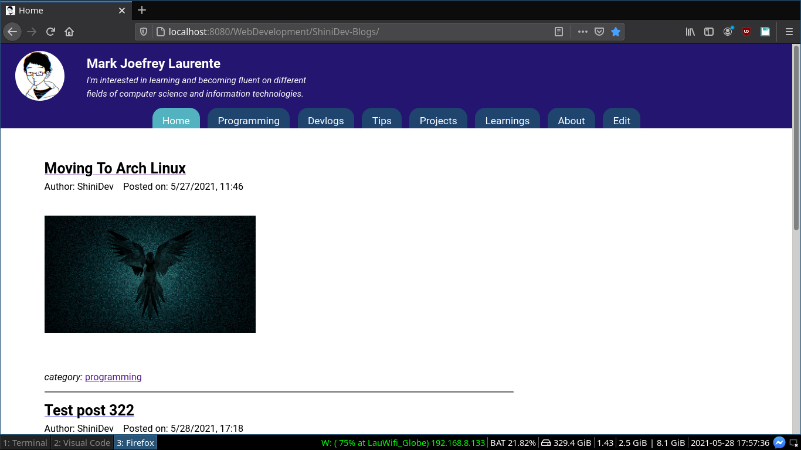
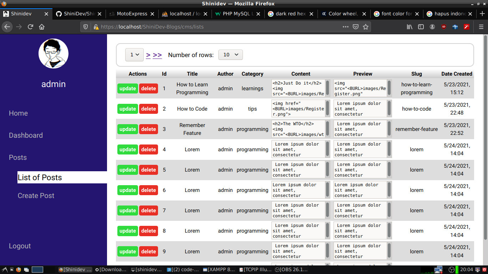
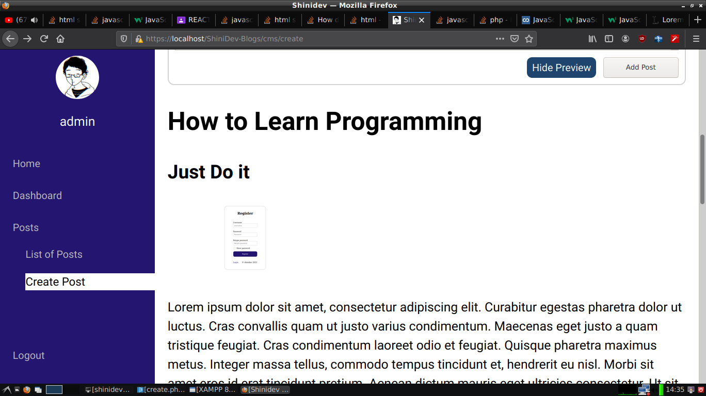

<h1>ShiniDev-Blogs</h1>

A blog site with content management system implemented with codeigniter, js, and pure css.

Current Features<ol>
  <li>Login/Register implemented using session</li>
</ol>
Planned Features<ol>
  <li><s>Content Management of Blog Posts / CRUD</s> - Done</li>
  <li><s>Clean display of blog posts in home page</s> - Done</li>
  <li>Recent blog posts on sidebar</li>
  <li><s>Group blog posts on specific tags</s> - Done</li>
  <li><s>Images on blog posts</s></li>
</ol>
Plans<ol>
	<li><s>Remove register feature, as this is a blog site</s> - Done</li>
</ol>

<h2>Latest Preview</h2>

<h2>Preview</h2>

